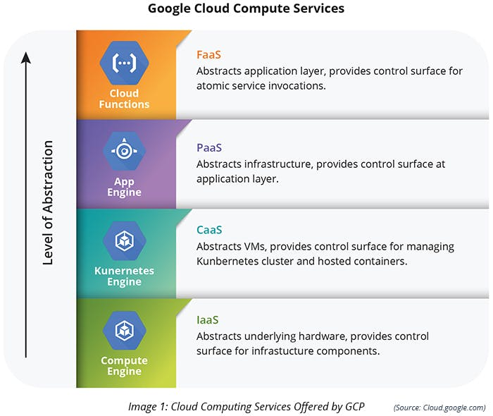
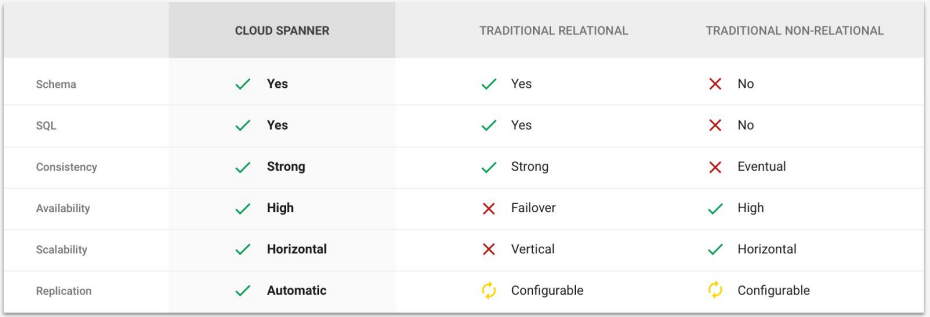

# 2.- Planning and configuring a cloud solution

## 2.1.- Planning and estimating GCP product use using the Pricing Calculator

* Video
    - [Google Cloud Platform on a shoestring budget](https://www.youtube.com/watch?v=N2OG1w6bGFo)
    - [Pricing Calculator](https://www.youtube.com/watch?v=gZidr8ztscw)
    - [Questions about Cost/Pricing](https://www.youtube.com/watch?v=fzW0ykVabpU)

* Doc References
    - [Link Key](https://cloud.google.com/products/calculator)
---
## 2.2.- Planning and configuring compute resources
---
### 2.2.1 - Selecting appropriate compute choices for a given workload

- __Compute Engine__ - **Infrastructure as a Service (IaaS)**: It is a clean virtual machine (a new and an empty server). It’s important to take care of all configurations according to the requirement.
- __App Engine__ - **Platform as a Service (PaaS)**: It is a fully-managed service where we deploy code to make the application up and running. The maintenance, configuration, scaling, security patches, upgrades, etc. are managed by Google.
- __Kubernetes Engine__ - Container as a Service (CaaS): It is a container management service and is widely used in microservices to make them lightweight and independent.
- __Cloud Functions__ - Function as a service (FaaS): It is a fully-managed service. Some functions are executed for a few minutes or seconds. It doesn’t cause any wastage of resources while executing the function; instead, these cloud functions can be executed on the basis of triggers.



* Video
    - [Deciding between Compute Engine, Container Engine, App Engine and more](https://www.youtube.com/watch?v=g0dN8Hkh5H8)

#### 2.2.1.1 - Compute Engine
> And Compute Engine is, basically, kind of everything else, or even all of those things if you want. It's VM.
So you have full control to do whatever you need to do to connect things together.
It's also a really good fit for existing systems.

#### 2.2.1.2 - Kubernetes Engine
> Container Engine is a system of containers working together to solve your problems.

##### 2.2.1.3 - App Engine
> Video: [Get to know Google App Engine](https://www.youtube.com/watch?v=2PRciDpqpko)

> App Engine is focused on making your web code run extremely well.
It's optimized for that. And it's code first kind of thinking.

---
#### 2.2.2 - Using preemptible VMs and custom machine types as appropriate
- [What is a preemptible instance?](https://cloud.google.com/compute/docs/instances/preemptible)
* [Command references](https://cloud.google.com/sdk/gcloud/reference/compute/instances/create?hl=es)
* --preemptible
    > If provided, instances will be preemptible and time-limited. Instances may be preempted to free up resources for standard VM instances, and will only be able to run for a limited amount of time. Preemptible instances can not be restarted and will not migrate.
* Example
    - CREATE INSTANCE WITH 4 vCPUs and 5 GB MEMORY
        ```bash
        gcloud compute instances create my-vm --custom-cpu 4 --custom-memory 5
        ```

    - ENABLE PREEMPTIBLE OPTION
        ```bash
        gcloud compute instances create my-vm --zone us-central1-b --preemptible
        ```
#### **Machine Types**
- [Machine Types](https://cloud.google.com/compute/docs/machine-types)
* General-purpose machine types offer the best price-performance ratio for a variety of workloads.
    - __E2__ machine types are cost-optimized VMs that offer up to 32 vCPUs with up to 128 GB of memory with a maximum of 8 GB per vCPU. E2 machines have a predefined CPU platform running either an Intel or the second generation AMD EPYC Rome processor. E2 VMs provide a variety of compute resources for the lowest price on Compute Engine, especially when paired with committed-use discounts.

        Machine type | Machine name | vCPUs | Memory (GB)
        --|--|--|--|--
        standard | e2-standard-2 | 2 | 8
        high-memory | e2-highmem-2 | 2 | 16
        high-cpu | e2-highcpu-2 | 2 | 2

    - __N2__ machine types offer up to 80 vCPUs, 8 GB of memory per vCPU, and are available on the Intel Cascade Lake CPU platforms.

        Machine type | Machine name | vCPUs | Memory (GB)
        --|--|--|--|--
        standard | n2-standard-2 | 2 | 8
        high-memory | n2-highmem-2 | 2 | 16
        high-cpu | n2-highcpu-2 | 2 | 2

    - __N2D__ machine types offer up to 224 vCPUs, 8 GB of memory per vCPU, and are available on second generation AMD EPYC Rome platforms.
        - Support up to 224 vCPUs and 896 GB of memory

        Machine type | Machine name | vCPUs | Memory (GB)
        --|--|--|--|--
        standard | n2d-standard-1 | 2 | 8
        high-memory | n2d-highmem-2 | 4 | 16
        high-cpu | n2d-highmem-2 | 2 | 2
        
    - __N1__ machine types offer up to 96 vCPUs, 6.5 GB of memory per vCPU, and are available on Intel Sandy Bridge, Ivy Bridge, Haswell, Broadwell, and Skylake CPU platforms.

        Machine type | Machine name | vCPUs | Memory (GB)
        --|--|--|--|--
        standard | n1-standard-1 | 1 | 3.75
        high-memory | n1-highmem-2 | 2 | 13
        high-cpu | n1-highmem-2 | 2 | 1.80

* __M2 Memory-optimized__ machine types are ideal for memory-intensive workloads because they offer more memory per core than other machine types, with up to 12 TB of memory.

    Machine name | vCPUs | Memory (GB)
    --|--|--|--
    m2-ultramem-208 | 208 | 5,888
    
* __C2 Compute-optimized__ machine types offer the highest performance per core on Compute Engine and are optimized for compute-intensive workloads. Compute-optimized machine types offer Intel Scalable Processors (Cascade Lake) and up to 3.8 GHz sustained all-core turbo.
    - You cannot use regional persistent disks with compute-optimized machine types.

    Machine name | vCPUs | Memory (GB)
    --|--|--|--
    c2-standard-4 | 4 | 8

* __A2 Accelerator-optimized__ machine types are ideal for massively parallelized CUDA compute workloads, such as machine learning (ML) and high performance computing (HPC).

    Machine name | vCPUs | Memory (GB)
    --|--|--|--
    a2-highgpu-1g | 12 | 85

* __Shared-core__ machine types are available in the E2 and N1 families. These machine types timeshare a physical core. This can be a cost-effective method for running small, non-resource intensive applications.
    - __E2__: e2-micro, e2-small, and e2-medium shared-core machine types have 2 vCPUs available for short periods of bursting.

        Machine name | vCPUs | Fractional vCPUs1 |Memory (GB)
        --|--|--|--|--
        e2-micro | 2 | 0.25 | 1
        e2-small | 2 | 0.5 | 2
        e2-medium | 2 | 1 | 4

    - __N1__: f1-micro and g1-small shared-core machine types have up to 1 vCPU available for short periods of bursting.

        Machine name | vCPUs | Fractional vCPUs1 |Memory (GB)
        --|--|--|--|--
        f1-micro | 1 | 0.2 | 0.60
        g1-small | 1 | 0.5 | 1.70

```bash
gcloud compute machine-types list  --filter="zone:( us-central1-a europe-west1-d )"
```
**E2 machine types**

**N2 machine types**

**N1 machine types**

**N2D**


---
## 2.3.- Planning and configuring data storage options
* Video
    - [From blobs to relational tables: Where do I store my Data?](https://www.youtube.com/watch?v=rn_68hBqt20)
    - [Platform Overview - Data & Storage](https://www.youtube.com/watch?v=tc2940Zwvyk)
* Imagenes
    - 

    - 

### 2.3.1.- Product choice

#### 2.3.1.1.- Cloud SQL

    Cloud SQL is a fully-managed database service that makes it easy to set up, maintain, manage, and administer your relational databases on Google Cloud Platform.

* Doc Refence
    - [SQL](https://cloud.google.com/sql/docs/)
    - [What is Cloud SQL](https://www.youtube.com/watch?v=Kl8ig2BtLAY)

#### 2.3.1.2.- BigQuery

    A fast, highly scalable, cost-effective and fully-managed enterprise data warehouse for analytics at any scale

    BigQuery is Google's serverless, highly scalable, low cost enterprise data warehouse designed to make all your data analysts productive. Because there is no infrastructure to manage, you can focus on analyzing data to find meaningful insights using familiar SQL and you don't need a database administrator. BigQuery enables you to analyze all your data by creating a logical data warehouse over managed, columnar storage as well as data from object storage, and spreadsheets. BigQuery makes it easy to securelyshare insights within your organization and beyond as datasets, queries, spreadsheets and reports. BigQuery allows organizations tocapture and analyze data in real-time using its powerful streaming ingestion capability so that your insights are always current. BigQuery is free for up to 1TB of data analyzed each month and 10GB of data stored.

* Doc Reference
    - [BigQuery](https://cloud.google.com/bigquery/)
    - [What is BigQuery](https://www.youtube.com/watch?v=d3MDxC_iuaw)

#### 2.3.1.3.- Cloud Spanner

    The first horizontally scalable, strongly consistent, relational database service


* Doc Refence
    - [Spanner](https://cloud.google.com/spanner/)
    - [PDF](https://www.snia.org/sites/default/files/SDCIndia/2017/Slides/Rohit%20Gupta%20-%20Google%20-%20Cloud%20Spanner.pdf)
    - [What is Cloud Spanner](https://www.youtube.com/watch?v=bUSU1e9j8wc)

* Table
- 

#### 2.3.1.4.- Cloud Bigtable
    A fully managed, scalable NoSQL database service for large analytical and operational workloads
* Doc References
    - [BigTable](https://cloud.google.com/bigtable/)
---
### 2.3.2.- Choosing storage options

    Cloud Storage is a service for storing your objects in Google Cloud. An object is an immutable piece of data consisting of a file of any format. You store objects in containers called buckets. All buckets are associated with a project, and you can group your projects under an organization.

#### 2.3.2.1 - Regional
    Storing frequently accessed in the same region as your Google Cloud DataProc or Google Compute Engine instances that use it, such as for data analytics.
#### 2.3.2.2 - Multi-regional
    Storing data that is frequently accessed ("hot" objects) around the world, such as serving website content, streaming videos, or gaming and mobile applications.
#### 2.3.2.3 - Nearline
    Data you do not expect to access frequently (i.e., no more than once per month). Ideal for back-up and serving long-tail multimedia content.
#### 2.3.2.4 - Coldline
    Data you expect to access infrequently (i.e., no more than once per year). Typically this is for disaster recovery, or data that is archived and may or may not be needed at some future time.

* Table
- 

---
## 2.4.- Planning and configuring network resources

### 2.4.1.- Differentiating load balancing options
    By using Cloud Load Balancing, you can serve content as close as possible to your users on a system that can respond to over one million queries per second.

    Cloud Load Balancing is a fully distributed, software-defined managed service. It isn't hardware-based, so you don't need to manage a physical load balancing infrastructure.

    Google Cloud offers the following load balancing features:

        - Single IP address to serve as the frontend
        - Automatic intelligent autoscaling of your backends
        - External load balancing for when your users reach your applications from the internet
        - Internal load balancing for when your clients are inside of Google Cloud
        - Regional load balancing for when your applications are available in a single region
        - Global load balancing for when your applications are available across the world
        - Pass-through load balancing (see also direct server return (DSR) or direct routing)
        - Proxy-based load balancing (as an alternative to pass-through)
        - Layer 4-based load balancing to direct traffic based on data from network and transport layer protocols, such as IP address and TCP or UDP port
        - Layer 7-based load balancing to add content-based routing decisions based on attributes, such as the HTTP header and the uniform resource identifier
        - Integration with Cloud CDN for cached content delivery

- 

* Doc References
    - [Type Cloud Load Balancer](https://cloud.google.com/load-balancing/docs/load-balancing-overview#types-of-cloud-load-balancing)
    - [Chossing Load Balancer](https://cloud.google.com/load-balancing/docs/choosing-load-balancer)
    - [Load balancer features](https://cloud.google.com/load-balancing/docs/features)
* Table
- 
---
### 2.4.2.- Identifying resource locations in a network for availability

    - logical location in the network (i.e. subnets, load balancers, and what not).
    - physical location in the world.

    The logical location can also be helpful for things like setting security boundaries, but I think the physical location also matters a lot to availability. In particular, you would want to spread your resources across at least multiple (availability) zones and as you've suggested load balance across them to get rid of the single points of failure.

    Basically, I would choose to read this line as "Identifying (physical) resource locations for availability and also (logically) networking them for availability."

---
### 2.4.3.- Configuring Cloud DNS

*Enable the DNS API*
```bash
gcloud services enabled dns.googleapis.com
```
*Create a virtual machine instance*
```bash
gcloud auth login --no-launch-browser
gcloud config set project sign-in-21-ccf
gcloud config list

gcloud compute machine-types list

gcloud compute instances create my-instance 
--machine-type=f1-micro 
--zome=us-central1-a
--preemptible 
--no-restart-on-failure
--maintenance-policy=terminate

gcloud compute instances list

gcloud compute instances describe my-instance

gcloud compute instances ssh my-instance

sudo apt update && sudo apt -y install apache2

echo '<!doctype html><html><body><h1>Hello World!</h1></body></html>' | sudo tee /var/www/html/index.html

```
*Create a managed public zone*
```bash
gcloud dns managed-zones create my_zone --dns-name=cesarcastillo.cl  --description="my zone for cesarcastillo.cl" --dnssec-state=off --visibility=public
```

*The Zone details page*
```bash
gcloud dns managed-zones list
```

*Create a record to point the domain to an external IP address*
```bash
gcloud dns record-sets transaction start --zone="my-zone"
  
gcloud dns record-sets transaction add 10.2.3.4 --name="cesarcastillo.cl" --ttl="5"   --type="A" --zone="my-zone"

gcloud dns record-sets transaction execute --zone="my-zone"
```

*Create a CNAME record for the www subdomain*
```bash 
gcloud dns record-sets transaction add "www.cesarcastillo.cl"--zone="my-zone" --name="*.cesarcastillo.cl" --type=CNAME --ttl=300 
```

*Mostrar los regitsrol actual*
```bash
gcloud dns record-sets list --zone="myzonename"
```

*Para quitar una transacción*
```bash
gcloud dns record-sets transaction remove 10.2.3.4 --name="cesarcastillo.cl" --ttl="5" --type="A"     --zone="my-zone"
```
*Removing a record*
```bash
gcloud dns record-sets transaction remove 10.2.3.4 --name="cesarcastillo.cl" --ttl="5" --type="A"     --zone="my-zone"
```
*deletes an empty Cloud DNS managed-zone*
```bash
touch empty-file

gcloud dns record-sets import -z NAME    --delete-all-existing empty-file

rm empty-file

gcloud dns managed-zones delete my-zone
```

*Stopin VM*
```bash
gcloud compute instances stop my-instance

gcloud compute instances delete my-instance --quiet
```

* Doc References
    - [Cloud DNS](https://cloud.google.com/dns/docs/overview)
    - [Setting up a domain using Cloud DNS](https://cloud.google.com/dns/docs/tutorials/create-domain-tutorial)
    - [Managing records](https://cloud.google.com/dns/docs/records)
    - [Commands gcloud](https://cloud.google.com/sdk/gcloud/reference/dns?hl=es)
* Video
    - [Administra tus dominios con el servicio de Google Cloud DNS](https://www.youtube.com/watch?v=sw-NhOwOQdI)

---