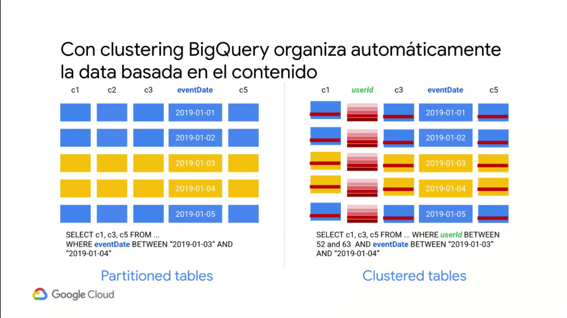
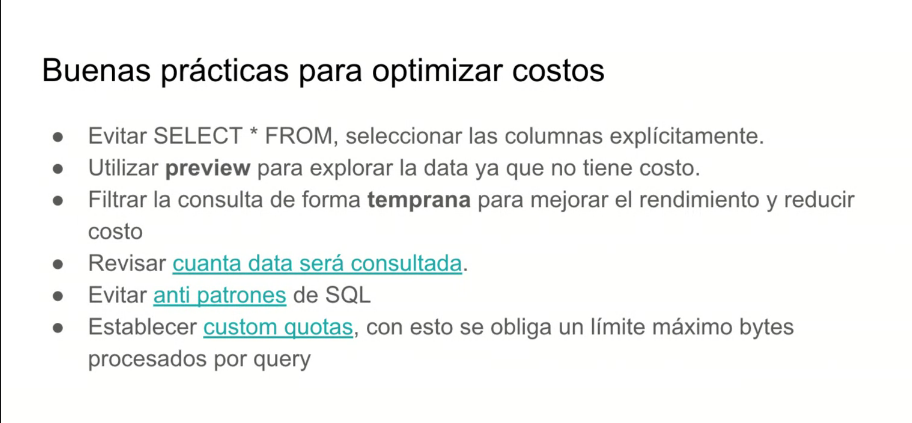

# 3.-  Deploying and implementing a cloud solution

## 3.4.- Deploying and implementing data solutions

### 3.4.1.- Initializing data systems with products
---
#### **Cloud SQL**
Cloud SQL es una base de datos MySQL ubicada en la nube de Google. Tiene todas las características y funciones de MySQL, además de algunas adicionales (y otras funciones no compatibles).

Google Cloud SQL es un servicio de base de datos totalmente administrado que facilita la configuración, mantenimiento y administración de sus bases de datos relacionales en Google Cloud Platform. Puede usar Cloud SQL con MySQL o PostgreSQL.

*By default Cloud SQL retains 7 days of automated backups, plus all on-demand backups, for an instance*
*CloudSQL only stores last 7 automated backups and this setting cannot be changed as of writing this question.*


- Doc References
    * [Creating a MySQL instance](https://cloud.google.com/sql/docs/mysql/create-instance#create-2nd-gen)

- [Using the Cloud SDK](https://cloud.google.com/sql/docs/mysql/cloud-sdk)

```bash
gcloud sql instances create INSTANCE_NAME --cpu=NUMBER_CPUS --memory=MEMORY_SIZE --region=REGION

gcloud sql users set-password root --host=% --instance INSTANCE_NAME --password PASSWORD
```

**Legacy MySQL high availability option**

Until Q1 2021, you have the option of using the legacy process for adding high availability to MySQL instances, which uses a **failover replica**

---
#### **Cloud Datastore**
Cloud Datastore es un almacén de datos de NoSQL sin esquema en la nube de Google

- Doc References
* [Index Configuration](https://cloud.google.com/datastore/docs/tools/indexconfig)
* [Using the gcloud Tool](https://cloud.google.com/datastore/docs/tools)

<>

- [Using the gcloud Tool to Test Applications and Manage Indexes](https://cloud.google.com/datastore/docs/tools)


*index.yaml*
```yaml
indexes:

- kind: Task
  ancestor: no
  properties:
  - name: done
  - name: priority
    direction: desc

- kind: Task
  properties:
  - name: collaborators
    direction: asc
  - name: created
    direction: desc

- kind: TaskList
  ancestor: yes
  properties:
  - name: percent_complete
    direction: asc
  - name: type
    direction: asc
```

```bash
gcloud datastore indexes create ~/.config/gcloud/emulators/datastore/WEB-INF/index.yaml

gcloud datastore indexes cleanup ~/.config/gcloud/emulators/datastore/WEB-INF/index.yaml
```
```javascript
const datastore = require('@google-cloud/datastore')({
    projectId: 'your-project-id'
});
const entity = {
- kind: TaskList
    key: datastore.key(['TaskList', 5629499534213120, 'TaskItem']),
    data: {
        name: 'Milk',
        completed: false
    }
};
datastore.save(entity, (err) => {
    if (err) {
        console.log('There was an error...', err);
    } else {
        console.log('Saved entity:', entity);
    }
});
```
---
#### **Cloud Bigtable**

Cloud Bigtable es una tabla poblada de manera dispersa que puede escalar miles de millones de filas y miles de columnas, lo que te permite almacenar terabytes o, incluso, petabytes de datos. Se indexa solo un valor de cada fila; este es conocido como la clave de fila. Cloud Bigtable es ideal para almacenar cantidades grandes de datos con una sola clave y con una latencia muy baja. Admite una capacidad alta de procesamiento de lectura y escritura con baja latencia, y es la fuente de datos ideal para las operaciones de MapReduce.

- [Quickstart using the cbt tool](https://cloud.google.com/bigtable/docs/quickstart-cbt)


```bash
export GOOGLE_APPLICATION_CREDENTIALS="[PATH]"

gcloud components update
gcloud components install cbt

gcloud bigtable instances create quickstart-instance  --display-name="My Instance" --cluster=my-cluster-id  --cluster-zone=us-east1-c
```

- create file */.cbtrc*
    ```properties
    project = project-id
    instance = quickstart-instance
    ```
```bash
cbt createtable my-table

cbt ls

cbt createfamily my-table cf1

cbt ls my-table

cbt set my-table r1 cf1:c1=test-value

cbt read my-table

cbt deletetable my-table

cbt deleteinstance quickstart-instance
```
---
#### **BigQuery**

BigQuery es el almacén de datos de estadísticas rentable, a escala de petabytes y completamente administrado de Google Cloud que te permite ejecutar estadísticas en grandes cantidades de datos casi en tiempo real. Con BigQuery, no debes configurar ni administrar ninguna infraestructura, lo que te permite enfocarte en encontrar estadísticas significativas mediante SQL estándar y aprovechar los modelos de precios flexibles en las opciones a pedido y de tasa fija

*Allowable types*
Type Name |	Valid Column Type?|	Valid Key Column Type? |	Valid SQL Type?|	Storage Size
---|---|---|---|---
ARRAY	|yes	|no	|yes	|The sum of the size of its elements
BOOL	|yes	|yes	|yes	|1 byte
BYTES	|yes	|yes	|yes	|The number of bytes
DATE	|yes	|yes	|yes	|4 bytes
FLOAT64	|yes	|yes	|yes	|8 bytes
INT64	|yes	|yes	|yes	|8 bytes
NUMERIC	|yes	|no	|yes	|A function of both the precision and scale of the value being stored. The value 0 is stored as 1 byte. The storage size for all other values varies between 6 and 22 bytes.
STRING	|yes	|yes	|yes	|The number of bytes in its UTF-8 encoding
STRUCT	|no	|no	|yes	|Not applicable
TIMESTAMP	|yes	|yes	|yes	|12 bytes


*Data type properties*
Property|	Description|	Applies To
---|---|---
Nullable|	NULL is a valid value.	|All data types.
Orderable|	Can be used in an ORDER BY clause.	|All data types except for:ARRAY STRUCT
Groupable|	Can generally appear in an expression following GROUP BY and DISTINCT.| All data types except for: ARRAY STRUCT 
Comparable|	Values of the same type can be compared to each other.	|All data types, with the following exceptions: ARRAY comparisons are not supported.Equality comparisons for STRUCTs are supported field by field, in field order. Field names are ignored. Less than and greater than comparisons are not supported.All types that support comparisons can be used in a JOIN condition. See JOIN Types for an explanation of join conditions.

- [Using the bq command-line tool](https://cloud.google.com/bigquery/docs/bq-command-line-tool)

```bash
bq show [PROJECT_ID]:[DATASET_ID].[TABLE_ID]

bq show bigquery-public-data:samples.shakespeare
    Table bigquery-public-data:samples.shakespeare
```
       Last modified                  Schema                 Total Rows   Total Bytes   Expiration
     ----------------- ------------------------------------ ------------ ------------- ------------
      26 Aug 14:43:49   |- word: string (required)           164656       6432064
                        |- word_count: integer (required)
                        |- corpus: string (required)
                        |- corpus_date: integer (required)
```bash
bq query --use_legacy_sql=false \
'SELECT
   word,
   SUM(word_count) AS count
 FROM
   `bigquery-public-data`.samples.shakespeare
 WHERE
   word LIKE "%raisin%"
 GROUP BY
   word'
```
    Waiting on job_dcda37c0bbed4c669b04dfd567859b90 ... (0s) Current status:
    DONE
    +---------------+-------+
    |     word      | count |
    +---------------+-------+
    | Praising      |   4   |
    | raising       |   5   |
    | raisins       |   1   |
    | praising      |   8   |
    | dispraising   |   2   |
    | dispraisingly |   1   |
    +---------------+-------+
```bash
bq ls

bq ls publicdata:

bq mk babynames

bq load babynames.names2010 yob2010.txt name:string,gender:string,count:integer
```
Waiting on job_4f0c0878f6184119abfdae05f5194e65 ... (35s) Current status: DONE
```bash
bq ls babynames
```
    tableId    Type
 ----------- -------
  names2010   TABLE
```bash
bq show babynames.names2010
```
Table myprojectid:babynames.names2010

   Last modified         Schema         Total Rows   Total Bytes   Expiration
 ----------------- ------------------- ------------ ------------- ------------
  13 Mar 15:31:00   |- name: string     34041        653855
                    |- gender: string
                    |- count: integer
```bash
bq rm -r babynames
```

*dry-run*

Cuando ejecutas una consulta en la herramienta de línea de comandos de bq, puedes usar la marca --dry_run para estimar la cantidad de bytes que lee la consulta. También puedes usar el parámetro dryRun cuando envíes un trabajo de consulta mediante la API o las bibliotecas cliente.

Puedes usar la estimación que muestra la ejecución de prueba para calcular los costos de consulta en la calculadora de precios. No se te cobrará por realizar la ejecución de prueba.
```bash
bq query \
--use_legacy_sql=false \
--dry_run \
'SELECT
   COUNTRY,
   AIRPORT,
   IATA
 FROM
   `project_id`.dataset.airports
 LIMIT
   1000'
 ```
**other commands**

Any of the following commands:

- add-iam-policy-binding
- cancel,
- cp
- extract
- get-iam-policy
- head
- help
- init
- insert
- load
- ls
- mk
- mkdef
- partition
- query
- remove-iam-policy-binding
- rm
- set-iam-policy
- shell
- show
- update
- version
- wait

#### BigQuery soporta 3 tipos de particionamientos

* Ingestion time
```bash
bq query --destination_table mydataset.mytable --time_partitioning_type=DAY --requiere_partition_filter
```

* Any column that is of type DATE or TIMESTAMP
```bash
bq mk --table --schema a:STRING,tm:TIMESTAMP --time_partitioning_field tm
```
* Integer-typed column
```bash
bq mk --table --schema "customer_id:nteger, value:integer" --range_partitioning=customer_id,0,10,
```

El particionamineto puede mejorar el costo de la consulta y su rendimiento reduciendo la cantidad de data consultada

SELECT 
  field1 
FROM 
  mudataset.mytable1 
WHERE 
  _PARTITIONTIME > TIMESTAMP_SUB(TIMESTAMP('2016-04-15'), INTERNAL 5 DAY)
(aislar el )

##### particionamineto de tabals existentes en BigQuery

- create table [schema-name].[tabla a crear]
- partition by date([timestamp-column])
- 

##### Clustering BigQuery





[Avoiding SQL anti-patterns](https://cloud.google.com/bigquery/docs/best-practices-performance-patterns)

[Creating Custom cost control](https://cloud.google.com/bigquery/docs/custom-quotas)

[Controlling costs in BigQuery](https://cloud.google.com/bigquery/docs/best-practices-costs)
---
#### **Cloud Spanner**
Cloud Spanner es un servicio de bases de datos relacionales esencial y completamente administrado que ofrece coherencia en las transacciones a escala global, esquemas, SQL (ANSI 2011 con extensiones) y replicación automática síncrona para brindar una alta disponibilidad.

- [Getting started with Cloud Spanner using gcloud](https://cloud.google.com/spanner/docs/getting-started/gcloud)

```bash
gcloud spanner --project=PROJECT_ID instance-configs list

gcloud spanner instance-configs list

gcloud spanner instances create my-instance-id  --config=regional-us-east1  --description=my-instance-display-name --nodes=3

gcloud spanner databases create testdb --instance=my-instance-id

gcloud spanner databases create testdb --instance=my-instance-id
    --ddl='CREATE TABLE mytable (a INT64, b INT64) PRIMARY KEY(a)'

gcloud spanner databases ddl update my-database-id  --instance=my-instance-id
    --ddl='ALTER TABLE test_table ADD COLUMN a INT64'

gcloud spanner rows insert --table=Singers  --database=my-database --instance=my-instance  --data=SingerId=1,SingerName=abc

gcloud spanner rows insert --table=Singers  --database=my-database --instance=my-instance  --flags-file=path/to/file.yaml

gcloud spanner databases execute-sql example-db \
    --sql='SELECT SingerId, AlbumId, AlbumTitle FROM Albums'

gcloud spanner operations list --instance=my-instance-id  --type=INSTANCE

gcloud spanner operations list --instance=my-instance-id  --type=BACKUP

gcloud spanner operations list --instance=my-instance-id  --type=DATABASE

gcloud spanner operations list --instance=my-instance-id  --database=my-database-id --type=DATABASE

gcloud spanner operations list --instance=my-instance-id  --database=my-database-id --type=BACKUP

gcloud spanner operations list --instance=my-instance-id  --backup=my-backup-id --type=BACKUP

gcloud spanner databases delete example-db

gcloud spanner instances delete test-instance
```
__What's the difference between Google Cloud Spanner and Cloud SQL?__

There is not a big difference between then in terms on what they do (storing data in tables). The difference is how they handle the data in a small and big scale

Cloud Spanner is used when you need to handle massive amounts of data with an elevated level of consistency and with a big amount of data handling (+100,000 reads/write per second). Spanner gives much better scalability and better SLOs.

On the other hand, Spanner is also much more expensive than Cloud SQL.

If you just want to store some data of your customer in a cheap way but still don't want to face server configuration Cloud SQL is the right choice.

If you are planning to create a big product or if you want to be ready for a huge increase in users for your application (viral games/applications) Spanner is the right product.

You can find detailed information about Cloud Spanner in this official paper

---
#### **Cloud Pub/Sub**
Pub/Sub is an asynchronous messaging service that decouples services that produce events from services that process events.

- [Quickstart using the gcloud command-line tool](https://cloud.google.com/pubsub/docs/quickstart-cli)

```bash
gcloud pubsub topics create my-topic

gcloud pubsub subscriptions create my-sub --topic=my-topic

gcloud pubsub topics publish my-topic --message="hello"

gcloud pubsub subscriptions pull my-sub --auto-ack
```
---
#### **Cloud Dataproc**
Dataproc es un servicio administrado de Spark y Hadoop con el que puede aprovechar herramientas de datos de código abierto para procesamientos por lotes, búsquedas, transmisiones y aprendizaje automático.

- [Quickstart using the gcloud command-line tool](https://cloud.google.com/dataproc/docs/quickstarts/quickstart-gcloud)

```bash
gcloud dataproc clusters create example-cluster --region=region

gcloud dataproc jobs submit spark --cluster example-cluster \
    --region=region \
    --class org.apache.spark.examples.SparkPi \
    --jars file:///usr/lib/spark/examples/jars/spark-examples.jar -- 1000

gcloud dataproc clusters update example-cluster \
    --region=region \
    --num-workers 5

gcloud dataproc clusters delete example-cluster \
    --region=region
```
---
#### **Cloud Storage**
Cloud Storage es un servicio para almacenar tus objetos en Google Cloud. Un objeto es un dato inmutable que consta de un archivo de cualquier formato. Los objetos se almacenan en contenedores llamados depósitos

- [Usa la herramienta de gsutil](https://cloud.google.com/storage/docs/quickstart-gsutil)

```bash
gsutil mb -b on -l us-east1 gs://my-awesome-bucket/

gsutil cp Desktop/kitten.png gs://my-awesome-bucket

gsutil cp gs://my-awesome-bucket/kitten.png Desktop/kitten2.png

gsutil cp gs://my-awesome-bucket/kitten.png gs://my-awesome-bucket/just-a-folder/kitten3.png

gsutil ls gs://my-awesome-bucket

gsutil ls -l gs://my-awesome-bucket/kitten.png

gsutil iam ch allUsers:objectViewer gs://my-awesome-bucket

gsutil iam ch -d allUsers:objectViewer gs://my-awesome-bucket

gsutil iam ch user:jane@gmail.com:objectCreator,objectViewer gs://my-awesome-bucket

gsutil iam ch -d user:jane@gmail.com:objectCreator,objectViewer gs://my-awesome-bucket

gsutil rm gs://my-awesome-bucket/kitten.png

gsutil rm -r gs://my-awesome-bucket
```
**Bucket name requirements**
Your bucket names must meet the following requirements:

    - Bucket names must contain only lowercase letters, numbers, dashes (-), underscores (_), and dots (.). Spaces are not allowed. Names containing dots require verification.
    - Bucket names must start and end with a number or letter.
    - Bucket names must contain 3-63 characters. Names containing dots can contain up to 222 characters, but each dot-separated component can be no longer than 63 characters.
    - Bucket names cannot be represented as an IP address in dotted-decimal notation (for example, 192.168.5.4).
    - Bucket names cannot begin with the "goog" prefix.
    - Bucket names cannot contain "google" or close misspellings, such as "g00gle".

**Bucket name considerations**
- Bucket names reside in a single Cloud Storage namespace.

This means that:

    - Every bucket name must be unique.
    - Bucket names are publicly visible

> If you try to create a bucket with a name that already belongs to an existing bucket, Cloud Storage responds with an error message.

- A bucket name can only be assigned during creation.

> You cannot change the name of an existing bucket. Instead, you should create a new bucket with the desired name and move the contents from the old bucket to the new bucket. See Moving and Renaming Buckets for a step-by-step guide.

- Once you delete a bucket, anyone can reuse its name for a new bucket.

> The time it takes a deleted bucket's name to become available again is typically on the order of seconds; however, if you delete the project that contains the bucket, which effectively deletes the bucket as well, the bucket name may not be released for weeks or longer.

- You can use a bucket name in a DNS record as part of a CNAME or A redirect.

> In order to do so, your bucket name should conform to standard DNS naming conventions. This means that your bucket name should not use underscores (_) or have a period next to another period or dash. For example, ".." is not valid within DNS names and neither is "-." or ".-".

**Bucket locations**
Regions
    - US-CENTRAL1
    - SOUTHAMERICA-EAST1
    - EUROPE-CENTRAL2
    - ASIA-EAST1

Multi-regions
    - ASIA
    - EU
    - US

Dual-regions
    - ASIA1
    - EUR4
    - NAM4


**signurl - Create a signed url**
> The signurl command will generate a signed URL that embeds authentication data so the URL can be used by someone who does not have a Google account.

- [Options](https://cloud.google.com/storage/docs/gsutil/commands/signurl#options)

OPTIONS|Descriptions
---|---
-c | Specifies the content type for which the signed url is valid for.
-m | Specifies the HTTP method to be authorized for use with the signed url, default is GET. You may also specify RESUMABLE to create a signed resumable upload start URL. When using a signed URL to start a resumable upload session, you will need to specify the 'x-goog-resumable:start' header in the request or else signature validation will fail.
-d | Specifies the duration that the signed url should be valid for, default duration is 1 hour.
-p | Specify the private key password instead of prompting.
-u | Use service account credentials instead of a private key file to sign the url.
-r | Specifies the region in which the resources for which you are creating signed URLs are stored.

#### examples

```bash
#Create a signed url for downloading an object valid for 10 minutes:
gsutil signurl -d 10m <private-key-file> gs://<bucket>/<object>


#Create a signed url without a private key, using a service account's credentials:
gsutil signurl -d 10m -u gs://<bucket>/<object>

#Create a signed url by impersonating a service account:
gsutil -i <service account email> signurl -d 10m -u gs://<bucket>/<object>

#Create a signed url, valid for one hour, for uploading a plain text file via HTTP PUT:
gsutil signurl -m PUT -d 1h -c text/plain <private-key-file> 
gs://<bucket>/<obj>

#To construct a signed URL that allows anyone in possession of the URL to PUT to the specified bucket for one day, creating an object of Content-Type image/jpg, run:
gsutil signurl -m PUT -d 1d -c image/jpg <private-key-file>   gs://<bucket>/<obj>

#To construct a signed URL that allows anyone in possession of the URL to POST a resumable upload to the specified bucket for one day, creating an object of Content-Type image/jpg, run:
gsutil signurl -m RESUMABLE -d 1d -c image/jpg <private-key-file> gs://bucket/<obj>
```

