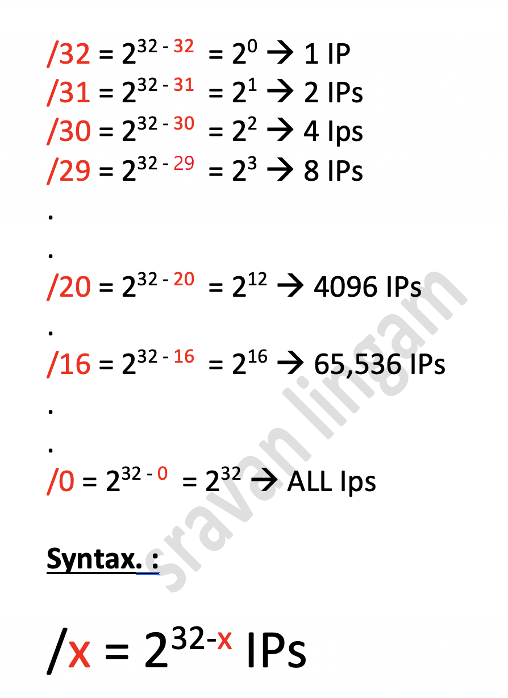
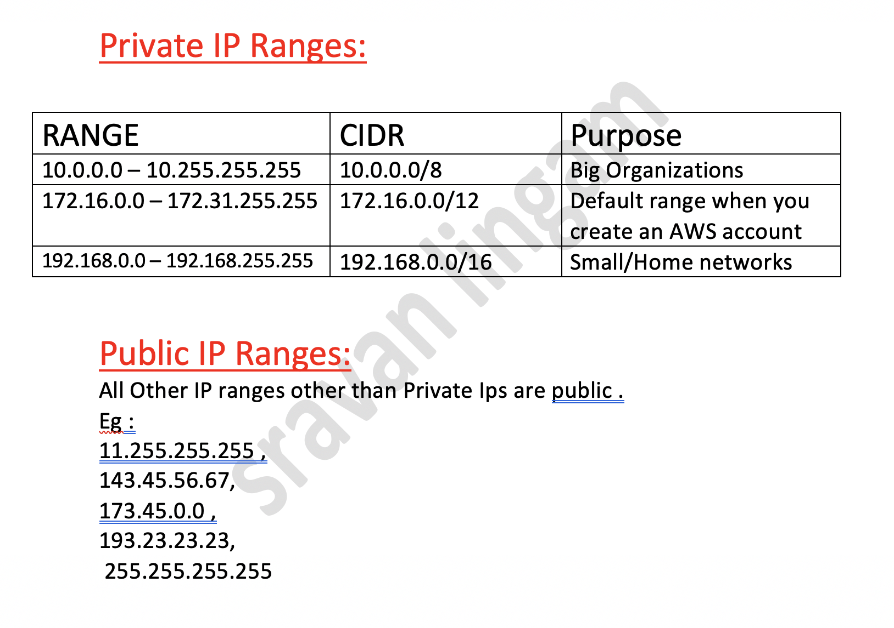

# 3.-  Deploying and implementing a cloud solution

## 3.5.- Deploying and implementing networking resources
---
#### VPC overview
La nube privada virtual (VPC) proporciona funcionalidad de herramientas de redes para Compute Engine machine virtual (VM) instances, los clústeres de Google Kubernetes Engine (GKE) y App Engine flexible environment. La VPC brinda herramientas de redes globales, escalables y flexibles a los recursos y servicios basados en la nube.

* Provides connectivity for your Compute Engine virtual machine (VM) instances, including Google Kubernetes Engine (GKE) clusters, App Engine flexible environment instances, and other Google Cloud products built on Compute Engine VMs.
* Offers native Internal TCP/UDP Load Balancing and proxy systems for Internal HTTP(S) Load Balancing.
* Connects to on-premises networks using Cloud VPN tunnels and Cloud Interconnect attachments.
* Distributes traffic from Google Cloud external load balancers to backends.

#### VPC networks
Las Redes VPC es como una **red física que se virtualiza** dentro de Google Cloud. Una red de VPC es un recurso global compuesto por una lista de **subredes virtuales regionales (subredes) en centros de datos**, todas conectadas por una red de área extensa global. Las redes de VPC están aisladas de **forma lógica** unas de otras dentro de Google Cloud.


#### Firewall rules
Cada red de VPC implementa un firewall virtual distribuido que puedes configurar. Las reglas de firewall te permiten controlar qué paquetes pueden trasladarse a qué destinos. Cada red de VPC tiene dos reglas de firewall implícitas que bloquean todas las conexiones entrantes y permiten todas las conexiones salientes.

La red default tiene reglas de firewall adicionales, incluida la regla default-allow-internal, que permiten la comunicación entre las instancias de la red.
##### what is Firewall rules?
- Firewall rules allow you too permit incoming (INGRESS) and outgoing (EGRESS) traffic to/from your VM instances
- They are specif to a VPC network
- Each rule either allows or denies traffic when its conditions are met.
    * type of traffic (Port and protocols)
    * Source
    * Destination
- Forewall ruels only support IPv4 Traffic
- There is no logging mechanism for firewall rules.
- GCP firewall rules are stateful.
- Lower the priority number, higher the priority.
- Conflicting rules with lower priorities are ignores.

##### what is Firewall rules made of ?
- A numercial priority
- the direction traffic
    * ingress
    * egress
- Action on match
    * allow
    * deny
- target
- Source
- Protocol
- Enforcement status

[Demo Firewall rules](https://www.youtube.com/watch?v=F1pWN3Lk7og)

#### Routes
Las rutas indican a las instancias de VM y a la red de VPC cómo enviar el tráfico de una instancia a un destino, ya sea dentro de la red o fuera de Google Cloud. Las redes de VPC incluyen algunas rutas generadas por el sistema para enrutar el tráfico entre sus subredes y enviarlo de las instancias aptas a Internet.

Puedes crear rutas estáticas personalizadas para dirigir algunos paquetes a destinos específicos.

#### Forwarding rules
While routes govern traffic leaving an instance, forwarding rules direct traffic to a Google Cloud resource in a VPC network based on IP address, protocol, and port.

Some forwarding rules direct traffic from outside of Google Cloud to a destination in the network; others direct traffic from inside the network. Destinations for forwarding rules are target instances, load balancer targets (target proxies, target pools, and backend services), and Cloud VPN gateways.

#### Shared VPC
You can share a VPC network from one project (called a host project) to other projects in your Google Cloud organization. You can grant access to entire Shared VPC networks or select subnets therein by using specific IAM permissions. This lets you provide centralized control over a common network while maintaining organizational flexibility. Shared VPC is especially useful in large organizations.

#### VPC Network Peering
VPC Network Peering [El intercambio de tráfico entre redes de VPC] te permite compilar ecosistemas de **software como servicio (SaaS)** en Google Cloud, lo que hace que los servicios estén disponibles de forma privada en diferentes redes de VPC, ya sea que las redes estén en el mismo proyecto, en proyectos diferentes o en proyectos en diferentes organizaciones.

Con VPC Network Peering, todas las comunicaciones se realizan mediante direcciones IP internas. Según las reglas de firewall, las instancias de VM en cada red de intercambio de tráfico pueden comunicarse entre sí sin usar direcciones IP externas.

Las redes de intercambio de tráfico intercambian rutas de subredes por rangos de direcciones IP privadas de manera automática. El intercambio de tráfico entre redes de VPC te permite configurar si se intercambian los siguientes tipos de rutas:

Rutas de subredes para rangos de IP públicos que se reutilizan de forma privada
Rutas personalizadas estáticas y dinámicas
La administración de red para cada red de intercambio de tráfico es la misma: el intercambio de tráfico de red de VPC nunca intercambia las políticas de IAM. Por ejemplo, los administradores de red y de seguridad de una red de VPC no obtienen esas funciones para la red de intercambio de tráfico de forma automática.


---
### 3.5.1.- Creating a VPC with subnets
- Doc References - [VPC overview](https://cloud.google.com/vpc/docs/overview)
- Video1 - [Creating VPC and Subnets in Google Cloud Console](https://www.youtube.com/watch?v=W2Wlz3PcEIQ)
- Video2 - [Creating VPC and Subnets using gcloud CLI](https://www.youtube.com/watch?v=5pGm_ZDirBU)

#### **auto or Custom-mode VPC**
* Creating an auto mode 
    ```bash
    gcloud compute networks create NETWORK \
        --subnet-mode=auto \
        --bgp-routing-mode=DYNAMIC_ROUTING_MODE \
        --mtu=MTU
    ```
* Creating a custom mode network
```bash
    gcloud compute networks create NETWORK \
        --subnet-mode=custom \
        --bgp-routing-mode=DYNAMIC_ROUTING_MODE \
        --mtu=MTU
```
* Viewing networks
```bash
    gcloud compute networks list
```
NAME| SUBNET_MODE| BGP_ROUTING_MODE|IPV4_RANGE| GATEWAY_IPV4
---|---|---|---|---
custom-network   |CUSTOM       |REGIONAL| |
default          |AUTO         |REGIONAL| |
legacy-network1  |LEGACY       |REGIONAL|         10.240.0.0/16|  10.240.0.1

```bash
    gcloud compute networks describe NETWORK
```
- Working with subnets
    * Doc Ref : [Understanding CIDRs and Public vs Private IPs](https://dzone.com/articles/understanding-cidrs-classless-inter-domain-routing)

    * 
        - Calculation Details for 192.134.0.0/29
            * CIDR: 192.134.0.0/29
            * IPs in Range: 8 ( 2^ 32-29 = 2^ 3 =8)
            * Mask Bits:  29
            * CIDR IP Range: (192.134.0.0 - 192.134.0.7 )  i.e, 192.134.0.0,192.134.0.1,192.134.0.2,192.134.0.3,192.134.0.4,192.134.0.5,192.134.0.6,192.134.0.7, total of 8 IPs
            * Mask Bits: 29
            * Note: In Base IP, for IPv4 , we have a notation like w.x.y.z , 4 sections; each sections for eg: "w" can vary from 0 to 255 , likewise:
                - So the base IP is usually between the range of 0.0.0.0 to 255.255.255.255 (IPv4 range). Use this website here to calculate the CIDR range.
    * Private and Public range
        

```bash
gcloud compute networks subnets list

gcloud compute networks subnets list --network=NETWORK

gcloud compute networks subnets list --filter="region:(us-central1)"

gcloud compute networks subnets describe SUBNET --region=us-central1

gcloud compute networks subnets create SUBNET \
    --network=NETWORK \
    --range=PRIMARY_RANGE \
    --region=REGION
gcloud compute networks subnets delete SUBNET --region=REGION
```
> When creating a new subnet, use the --enable-private-ip-google-access flag to enable Private Google Access
```bash
    gcloud compute networks subnets create SUBNET_NAME \
    --region=REGION \
    --network=NETWORK_NAME \
    --range=PRIMARY_IP_RANGE \
    --enable-private-ip-google-access
```
* Expanding a primary IP range
```bash
gcloud compute networks subnets expand-ip-range SUBNET \
  --region=REGION \
  --prefix-length=PREFIX_LENGTH
```
* Editing secondary ranges
```bash
gcloud compute networks subnets update SUBNET \
  --region=REGION \
  --add-secondary-ranges=SECONDARY_RANGE_NAME=SECONDARY_RANGE

gcloud compute networks subnets update SUBNET \
  --region=REGION \
  --remove-secondary-ranges=SECONDARY_RANGE_NAME
```
* Converting to custom mode
```bash
gcloud compute networks update NETWORK \
    --switch-to-custom-subnet-mode
```
* Changing the dynamic routing mode
```bash
gcloud compute networks update NETWORK \
    --bgp-routing-mode=DYNAMIC_ROUTING_MODE[regional or global]
```
* Changing the MTU of a network
```bash
gcloud compute instances stop INSTANCE_NAMES... \
    --zone=ZONE

gcloud compute networks update NETWORK \
    --mtu=MTU

gcloud compute instances start INSTANCE_NAMES... \
    --zone=ZONE
```
* Deleting a network
```bash
gcloud compute networks delete NETWORK
```
---
#### **Shared VPC**
- Doc Ref - [Provisioning Shared VPC](https://cloud.google.com/vpc/docs/provisioning-shared-vpc)
- Video - [Creating a Shared Virtual Private Cloud](https://www.youtube.com/watch?v=4MtfyViH9t0)

Shared VPC permite exportar subredes desde una red de VPC en un **host project** a otros proyectos del servicio en la **misma organización**. Las instancias de los proyectos del servicio pueden tener conexiones de red en las **subnets shared** [subredes compartidas] del host project.

- Organization policies for Shared VPC
```bash
gcloud auth login ORG_ADMIN

gcloud beta resource-manager org-policies enable-enforce \
    --organization ORG_ID compute.restrictXpnProjectLienRemoval

gcloud auth revoke ORG_ADMIN
```
- Nominate Shared VPC Admins
```bash
gcloud auth login ORG_ADMIN

gcloud organizations add-iam-policy-binding ORG_ID \
  --member='user:EMAIL_ADDRESS' \
  --role="roles/compute.xpnAdmin,roles/resourcemanager.projectIamAdmin"

```
- Setting up Shared VPC
```bash
gcloud auth login SHARED_VPC_ADMIN

gcloud compute shared-vpc enable HOST_PROJECT_ID

gcloud beta compute shared-vpc enable HOST_PROJECT_ID

gcloud compute shared-vpc organizations list-host-projects ORG_ID

gcloud auth revoke SHARED_VPC_ADMIN
```
- Attach service projects
```bash
gcloud auth login SHARED_VPC_ADMIN

gcloud compute shared-vpc associated-projects add SERVICE_PROJECT_ID \
    --host-project HOST_PROJECT_ID

gcloud compute shared-vpc get-host-project SERVICE_PROJECT_ID

gcloud compute shared-vpc list-associated-resources HOST_PROJECT_ID

gcloud auth revoke SHARED_VPC_ADMIN
```
- Service Project Admins for all subnets
```bash
gcloud auth login SHARED_VPC_ADMIN

gcloud projects add-iam-policy-binding HOST_PROJECT_ID \
--member "user:SERVICE_PROJECT_ADMIN" \
--role "roles/compute.networkUser"

gcloud auth revoke SHARED_VPC_ADMIN
```
- Service Project Admins for some subnets
```bash
gcloud auth login SHARED_VPC_ADMIN

gcloud beta compute networks subnets get-iam-policy SUBNET_NAME \
    --region SUBNET_REGION \
    --project HOST_PROJECT_ID \
    --format json
```
```json
{
  "bindings": [
  {
     "members": [
           "user:[SERVICE_PROJECT_ADMIN]",
           "user:[SERVICE_PROJECT_ADMIN]"
        ],
        "role": "roles/compute.networkUser"
  }
  ],
  "etag": "[ETAG_STRING]"
}
```bash
gcloud beta compute networks subnets set-iam-policy SUBNET_NAME subnet-policy.json \
    --region SUBNET_REGION \
    --project HOST_PROJECT_ID

gcloud auth revoke SHARED_VPC_ADMIN
```
- Service Accounts as Service Project Admins
```bash
gcloud auth login SHARED_VPC_ADMIN

gcloud projects list

gcloud projects add-iam-policy-binding HOST_PROJECT_ID \
    --member "serviceAccount:SERVICE_ACCOUNT_NAME@SERVICE_PROJECT_ID.iam.gserviceaccount.com" \
    --role "roles/compute.networkUser"

or

gcloud auth login SHARED_VPC_ADMIN

gcloud projects describe SERVICE_PROJECT_ID --format='get(projectNumber)'

gcloud projects list

gcloud projects add-iam-policy-binding HOST_PROJECT_ID \
    --member "serviceAccount:SERVICE_PROJECT_NUMBER@cloudservices.gserviceaccount.com" \
    --role "roles/compute.networkUser"

```
- Using Shared VPC
    * Listing available subnets
    ```bash
        gcloud auth login SERVICE_PROJECT_ADMIN

        gcloud compute networks subnets list-usable --project HOST_PROJECT_ID


    ```
    * Reserving a static internal IP
```bash
gcloud compute networks subnets list-usable --project project-1
```
PROJECT|REGION|NETWORK|SUBNET|RANGE|SECONDARY_RANGES
---|---|---|---|---|---
project-1|us-west1|net-1|subnet-1|10.138.0.0/20| |
project-1|us-central1|net-1|subnet-2|10.128.0.0/20|r-1 192.168.2.0/24
| | | | | |                                                          r-2 192.168.3.0/24
project-1|us-east1|net-1|subnet-3|10.142.0.0/20| 

* Creating an instance
```bash
gcloud compute instances create INSTANCE_NAME \
--project SERVICE_PROJECT_ID \
--subnet projects/HOST_PROJECT_ID/regions/REGION/subnetworks/SUBNET \
--zone ZONE
```
---
### 3.5.2.- Launching a Compute Engine instance with custom network configuration
- Internal-only IP address
- Google private access
- Static external and private IP address
- network tags
---
### 3.5.3.- Creating ingress and egress firewall rules for a VPC
- IP subnets
- Tags
- Service accounts
---
### 3.5.4.- Creating a VPN between a Google VPC and an external network using Cloud VPN
---
### 3.5.5.- Creating a load balancer to distribute application network traffic to an application
- Global HTTP(S) load balancer
- Global SSL Proxy load balancer
- Global TCP Proxy load balancer
- Regional Network load balancer
- Regional Internal load balancer

