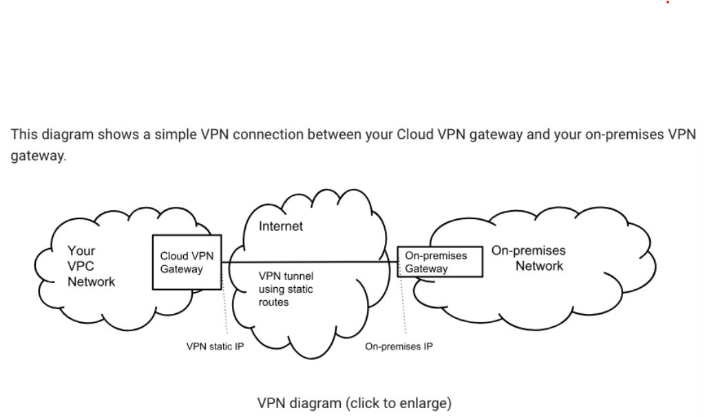

# 3.-  Deploying and implementing a cloud solution

## 3.5.- Deploying and implementing networking resources
---
### 3.5.4.- Creating a VPN between a Google VPC and an external network using Cloud VPN

- [Creating an HA VPN gateway to a peer VPN gateway](https://cloud.google.com/network-connectivity/docs/vpn/how-to/creating-ha-vpn)

- [Creating an HA VPN between Google Cloud networks](https://cloud.google.com/network-connectivity/docs/vpn/how-to/creating-ha-vpn2)

---

