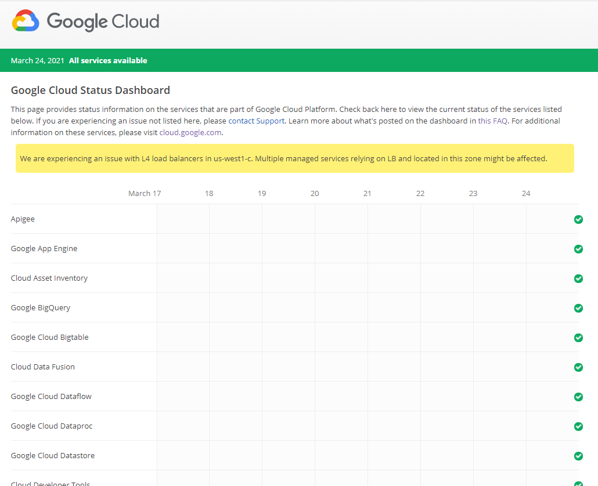

# 4.- Ensuring successful operation of a cloud solution
## 4.1.- Managing Compute Engine resources
---
## 4.6.- Monitoring and logging
---
### 4.6.1.- Creating Stackdriver alerts based on resource metrics

- video : [Stack Driver Monitoring, Logging and Alerting on Google Cloud Kubernetes Engine](https://youtu.be/oNEl-H0QWWg?t=789)
---
### 4.6.2.- Creating Stackdriver custom metrics

* Service Level Indicator (SLI)
    - latency
    - availability
* Service Level Objective (SLO)

tres opciones :
- log-based metrics
- OpenCensus
- Prometheus

[Customs Metrics](https://www.youtube.com/watch?v=IHbwrBixLAQ)

---
### 4.6.3.- Configuring log sinks to export logs to external systems

[Exporting Logs to BigQuery, GCS, Pub/Sub through Stackdriver](https://istio.io/latest/blog/2018/export-logs-through-stackdriver/)

**on premises**

To export all logs to a Logs bucket in a different project, run:
```bash
gcloud logging sinks create my-sink
logging.googleapis.com/projects/my-central-project/locations/global/buckets/my-central-bucket
``` 
**BigQuery**

To export all Google Compute Engine logs to BigQuery, run:
```bash
gcloud logging sinks create my-bq-sink
bigquery.googleapis.com/projects/my-project/datasets/my_dataset --log-filter='resource.type="gce_instance"'
```

**App Engine Flexible**

To export "syslog" from App Engine Flexible to Cloud Storage, run:
```bash
gcloud logging sinks create my-gcs-sink  storage.googleapis.com/my-bucket  --log-filter='logName="projects/my-project/appengine.googleapis.com%2Fsyslog"'
```

**App Engine**

To export Google App Engine logs with ERROR severity To BigQuery, run:
```bash
gcloud logging sinks create my-error-logs
bigquery.googleapis.com/projects/my-project/datasets/my_dataset --log-filter='resource.type="gae_app" AND severity=ERROR'
```


---
### 4.6.4.- Viewing and filtering logs in Stackdriver

- Video : [Getting started with Cloud Logging](https://www.youtube.com/watch?v=8HJDnh8TVOM)


The Logs Viewer interface has the following major components:
- A search bar to filter log entries by label or text search.
- Drop down menus to filter the list by resources, logs, and severity levels.
- Jump to time drop down menu to view a specific date and time in the logs.
- A Refresh button to retrieve the latest logs in descending order.
- Auto load log stream controls whether or not to display new log entries as they arrive.
    * Clicking Play starts the stream of the latest logs. The stream will stop if you scroll the logs display.
    * Clicking Pause stops the logs stream.
- The table of log summaries that you can click to view the full details for individual log entries.
- An Expand all down arrow at the top right corner of the log entries panel to show the details of all log entries. This action may take some time if the panel has a lot of log entries.
- If available, a source link to locate the source code that generates the log entry.

---
### 4.6.5.- Viewing specific log message details in Stackdriver

In the Logs Viewer interface, you can filter the log entries or search for specific logs to display.

**Filtering the logs**

You can filter the log entries to see only those logs you are interested in.

- In the resource type and instance drop-down menu, you can select all instances of a particular resource type you wish to see, or view a specific instance. For a list of resource types, see the Monitored Resources and Services.
- In the log type drop-down menu, select the named logs you want to view or select All logs. The menu only shows the logs that the selected resource generates.
- In the log severity drop-down menu, select the severity level you want to view. Selecting All log levels includes log entries that do not have a severity level.
- In the Jump to time drop-down menu, select a date and time. Choose if you want to see logs before or after the selected timestamp.

You can also click To Advanced Filter to access the advanced filter bar where you can filter the log entries through queries. Click the Advanced filter help link for more information.


---
### 4.6.6.- Using cloud diagnostics to research an application issue

- viewing Cloud Trace data
     * [Create a trace - Cloud Trace](https://cloud.google.com/trace/docs/quickstart)
- using Cloud Debug to view an application point-in-time
    * [View deployed source code - CLoud Debugger](https://cloud.google.com/debugger/docs/quickstart)
---
### 4.6.7.- Viewing Google Cloud Platform status


---
### 4.6.8.- Working with management interfaces
- Cloud Console
- Cloud Shell
- Cloud SDK

---
### Stackdriver Debugger ###

Stackdriver Debugger allows engineers to inspect an application's state, its variables and call stack at any line of code without stopping the application or impacting the customer. Being able to debug production code cuts short the many hours engineers invest in finding and reproducing a bug.