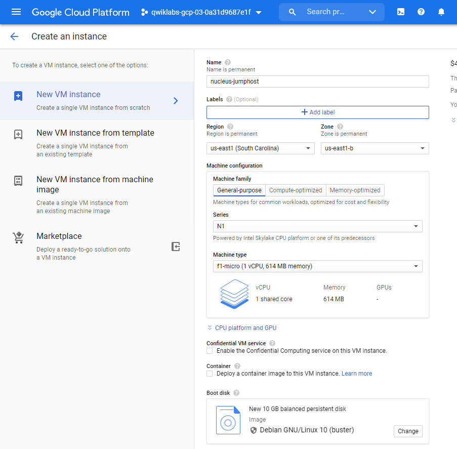

# Create and Manage Cloud Resources: Challenge Lab

Topics tested:

* Create an instance
* Create a 3-node Kubernetes cluster and run a simple service
* Create an HTTP(s) load balancer in front of two web servers

## Task 1: Create a project jumphost instance
You will use this instance to perform maintenance for the project.

### Requirements:

- Name the instance **nucleus-jumphost**.
- Use an **f1-micro** machine type (N1).
- Use the default image type **(Debian Linux)**.



---
## Task 2: Create a Kubernetes service cluster

The team is building an application that will use a service running on Kubernetes. You need to:

Create a cluster (in the us-east1-b zone) to host the service.
Use the Docker container hello-app (gcr.io/google-samples/hello-app:2.0) as a place holder; the team will replace the container with their own work later.
Expose the app on port 8080.

```bash
gcloud config set compute/zone us-east1-b

gcloud container clusters create my-cluster --zone us-east1-b

kubectl create deployment hello-app --image=gcr.io/google-samples/hello-app:2.0

kubectl expose deployment hello-app --type LoadBalancer --port 80 --target-port 8080

gcloud container clusters delete my-cluster
```
---
## Task 3: Set up an HTTP load balancer
You will serve the site via nginx web servers, but you want to ensure that the environment is fault-tolerant. Create an HTTP load balancer with a managed instance group of 2 nginx web servers. Use the following code to configure the web servers; the team will replace this with their own configuration later.

```bash
cat << EOF > startup.sh
#! /bin/bash
apt-get update
apt-get install -y nginx
service nginx start
sed -i -- 's/nginx/Google Cloud Platform - '"\$HOSTNAME"'/' /var/www/html/index.nginx-debian.html
EOF
```

You need to:

Create an instance template.
Create a target pool.
Create a managed instance group.
Create a firewall rule to allow traffic (80/tcp).
Create a health check.
Create a backend service, and attach the managed instance group.
Create a URL map, and target the HTTP proxy to route requests to your URL map.
Create a forwarding rule.

```bash
gcloud config set compute/region us-east1
gcloud config set compute/zone us-east1-b

# First, create the load balancer template:
gcloud compute instance-templates create lb-backend-template2 \
   --region=us-east1 \
   --network=default \
   --subnet=default \
   --tags=allow-health-check \
   --image-family=debian-9 \
   --image-project=debian-cloud \
   --metadata=startup-script="cat << EOF > startup.sh
#! /bin/bash
apt-get update
apt-get install -y nginx
service nginx start
sed -i -- 's/nginx/Google Cloud Platform - '"\$HOSTNAME"'/' /var/www/html/index.nginx-debian.html
EOF"

#Create a managed instance group based on the template:
gcloud compute instance-groups managed create lb-backend-group2 \
   --template=lb-backend-template2 --size=2

#Create the fw-allow-health-check firewall rule
gcloud compute firewall-rules create fw-allow-health-check \
    --network=default \
    --action=allow \
    --direction=ingress \
    --source-ranges=130.211.0.0/22,35.191.0.0/16 \
    --target-tags=allow-health-check \
    --rules=tcp:80

#set up a global static external IP address
gcloud compute addresses create lb-ipv4-1 \
    --ip-version=IPV4 \
    --global

#Create a healthcheck for the load balancer:
gcloud compute health-checks create http http-basic-check --port 80

#Create a backend service:
gcloud compute backend-services create web-backend-service \
        --protocol=HTTP \
        --port-name=http \
        --health-checks=http-basic-check \
        --global

#Add your instance group as the backend to the backend service:
gcloud compute backend-services add-backend web-backend-service \
        --instance-group=lb-backend-group \
        --instance-group-zone=us-east1-b \
        --global

#Create a URL map to route the incoming requests to the default backend service:
gcloud compute url-maps create web-map-http \
        --default-service web-backend-service

#Create a target HTTP proxy to route requests to your URL map:
gcloud compute target-http-proxies create http-lb-proxy \
        --url-map web-map-http

#Create a global forwarding rule to route incoming requests to the proxy:
gcloud compute forwarding-rules create http-content-rule \
        --address=lb-ipv4-1\
        --global \
        --target-http-proxy=http-lb-proxy \
        --ports=80