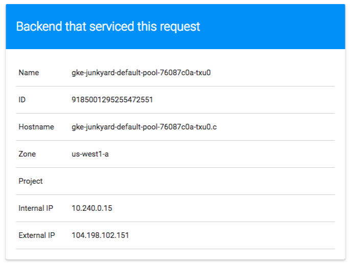
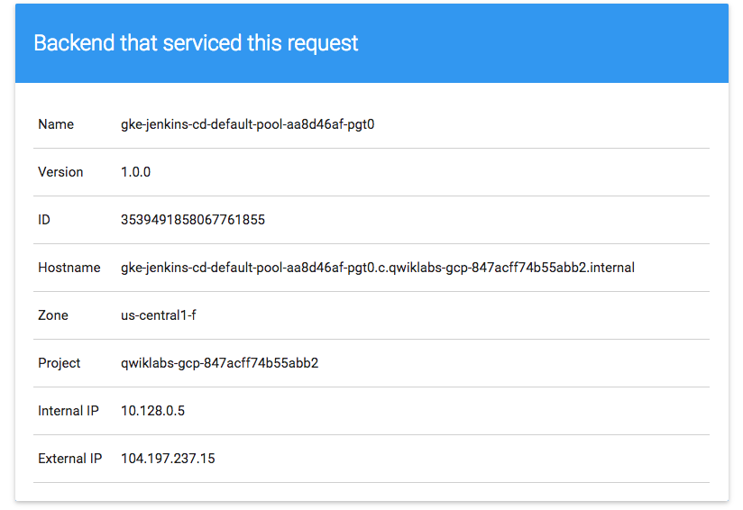
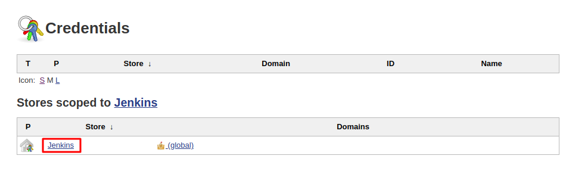
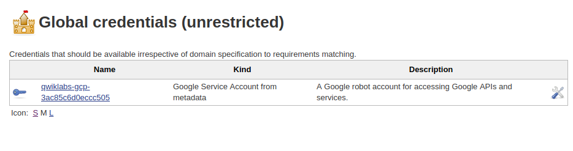

# Deploy to Kubernetes in Google Cloud

## Introdution to Docker

### Hello World

```bash
docker run hello-world
docker images
docker run hello-world
docker ps
docker ps -a
```

### Build
```bash
mkdir test && cd test
```

*Dockerfile*
cat > Dockerfile <<EOF
```Dockerfile
# Use an official Node runtime as the parent image
FROM node:6
# Set the working directory in the container to /app
WORKDIR /app
# Copy the current directory contents into the container at /app
ADD . /app
# Make the container's port 80 available to the outside world
EXPOSE 80
# Run app.js using node when the container launches
CMD ["node", "app.js"]
```
EOF


*app.js*

cat > app.js <<EOF
```javascript
const http = require('http');

const hostname = '0.0.0.0';
const port = 80;

const server = http.createServer((req, res) => {
    res.statusCode = 200;
      res.setHeader('Content-Type', 'text/plain');
        res.end('Hello World\n');
});

server.listen(port, hostname, () => {
    console.log('Server running at http://%s:%s/', hostname, port);
});

process.on('SIGINT', function() {
    console.log('Caught interrupt signal and will exit');
    process.exit();
});
```
EOF

```bash
docker build -t node-app:0.1 .
docker images
docker run -p 4000:80 --name my-app node-app:0.1

curl http://localhost:4000

docker stop my-app && docker rm my-app

docker run -p 4000:80 --name my-app -d node-app:0.1
docker ps

docker logs [container_id]

cd test
```
```javascript
....
const server = http.createServer((req, res) => {
    res.statusCode = 200;
      res.setHeader('Content-Type', 'text/plain');
        res.end('Welcome to Cloud\n');
});
....
```
```bash
docker build -t node-app:0.2 .
docker run -p 8080:80 --name my-app-2 -d node-app:0.2
docker ps

curl http://localhost:8080

```
### Debug


```bash
docker logs -f [container_id]

docker exec -it [container_id] bash

ls

docker inspect [container_id]

docker inspect --format='{{range .NetworkSettings.Networks}}{{.IPAddress}}{{end}}' [container_id]
```

### Publish

```bash
gcloud config list project

docker tag node-app:0.2 gcr.io/[project-id]/node-app:0.2

docker images

docker push gcr.io/[project-id]/node-app:0.2

docker stop $(docker ps -q)
docker rm $(docker ps -aq)

docker rmi node-app:0.2 gcr.io/[project-id]/node-app node-app:0.1
docker rmi node:6
docker rmi $(docker images -aq) # remove remaining images
docker images

docker pull gcr.io/[project-id]/node-app:0.2
docker run -p 4000:80 -d gcr.io/[project-id]/node-app:0.2
curl http://localhost:4000
```

---

# Kubernetes Engine: Qwik Start

* Activate Cloud Shell

```bash
gcloud auth list

gcloud config list project
```
## Task 1: Set a default compute zone
```bash
gcloud config set compute/zone us-central1-a
```
## Task 1: Set a default compute zone
```bash
gcloud container clusters create my-cluster
```
## Task 3: Get authentication credentials for the cluster
```bash
gcloud container clusters get-credentials my-cluster
```
## Task 4: Deploy an application to the cluster
```bash
kubectl create deployment hello-server --image=gcr.io/google-samples/hello-app:1.0

kubectl expose deployment hello-server --type=LoadBalancer --port 8080

kubectl get service

http://146.148.81.209:8080

```
## Task 5: Deleting the cluster
```bash
gcloud container clusters delete my-cluster
```
---
## Orchestrating the Cloud with Kubernetes
```bash
gcloud auth list

gcloud config list project

gcloud config set compute/zone us-central1-b

gcloud container clusters create io

gsutil cp -r gs://spls/gsp021/* .

cd orchestrate-with-kubernetes/kubernetes

ls

kubectl create deployment nginx --image=nginx:1.10.0

kubectl get pods

kubectl expose deployment nginx --port 80 --type LoadBalancer

kubectl get services

curl http://35.188.60.184:80
```
### Creating Pods
```bash
cat pods/monolith.yaml
```
```yaml
apiVersion: v1
kind: Pod
metadata:
  name: monolith
  labels:
    app: monolith
spec:
  containers:
    - name: monolith
      image: kelseyhightower/monolith:1.0.0
      args:
        - "-http=0.0.0.0:80"
        - "-health=0.0.0.0:81"
        - "-secret=secret"
      ports:
        - name: http
          containerPort: 80
        - name: health
          containerPort: 81
      resources:
        limits:
          cpu: 0.2
          memory: "10Mi"
```

```bash
kubectl create -f pods/monolith.yaml

kubectl get pods

kubectl describe pods monolith

kubectl port-forward monolith 10080:80

curl http://127.0.0.1:10080

curl http://127.0.0.1:10080/secure

curl -u user http://127.0.0.1:10080/login

TOKEN=$(curl http://127.0.0.1:10080/login -u user|jq -r '.token')

kubectl logs monolith

kubectl logs -f monolith

curl http://127.0.0.1:10080

kubectl exec monolith --stdin --tty -c monolith /bin/sh

ping -c 3 google.com

exit
```

### Services
### Creating a Service
```bash
cd ~/orchestrate-with-kubernetes/kubernetes

cat pods/secure-monolith.yaml
```
```yaml
apiVersion: v1
kind: Pod
metadata:
  name: "secure-monolith"
  labels:
    app: monolith
spec:
  containers:
    - name: nginx
      image: "nginx:1.9.14"
      lifecycle:
        preStop:
          exec:
            command: ["/usr/sbin/nginx","-s","quit"]
      volumeMounts:
        - name: "nginx-proxy-conf"
          mountPath: "/etc/nginx/conf.d"
        - name: "tls-certs"
          mountPath: "/etc/tls"
    - name: monolith
      image: "kelseyhightower/monolith:1.0.0"
      ports:
        - name: http
          containerPort: 80
        - name: health
          containerPort: 81
      resources:
        limits:
          cpu: 0.2
          memory: "10Mi"
      livenessProbe:
        httpGet:
          path: /healthz
          port: 81
          scheme: HTTP
        initialDelaySeconds: 5
        periodSeconds: 15
        timeoutSeconds: 5
      readinessProbe:
        httpGet:
          path: /readiness
          port: 81
          scheme: HTTP
        initialDelaySeconds: 5
        timeoutSeconds: 1
  volumes:
    - name: "tls-certs"
      secret:
        secretName: "tls-certs"
    - name: "nginx-proxy-conf"
      configMap:
        name: "nginx-proxy-conf"
        items:
          - key: "proxy.conf"
            path: "proxy.conf"
```
```bash
kubectl create secret generic tls-certs --from-file tls/

kubectl create configmap nginx-proxy-conf --from-file nginx/proxy.conf

kubectl create -f pods/secure-monolith.yaml

cat services/monolith.yaml
```

```yaml
kind: Service
apiVersion: v1
metadata:
  name: "monolith"
spec:
  selector:
    app: "monolith"
    secure: "enabled"
  ports:
    - protocol: "TCP"
      port: 443
      targetPort: 443
      nodePort: 31000
  type: NodePort
```

```bash
kubectl create -f services/monolith.yaml

gcloud compute firewall-rules create allow-monolith-nodeport --allow=tcp:31000

gcloud compute instances list

curl -k https://34.134.18.11:31000
```
> It's time for a quick knowledge check.Use the following commands to answer the questions below.
> kubectl get services monolith
> kubectl describe services monolith
> Questions:
> Why are you unable to get a response from the monolith service?
> How many endpoints does the monolith service have?
> What labels must a Pod have to be picked up by the monolith service?

### Adding Labels to Pods
```bash
kubectl get pods -l "app=monolith"
```
NAME              READY   STATUS    RESTARTS   AGE
monolith          1/1     Running   0          19m
secure-monolith   2/2     Running   0          7m24s

```bash
kubectl get pods -l "app=monolith,secure=enabled"
```
No resources found in default namespace.
```bash
kubectl label pods secure-monolith 'secure=enabled'
```
pod/secure-monolith labeled
```bash
kubectl get pods secure-monolith --show-labels
```
NAME              READY   STATUS    RESTARTS   AGE     LABELS
secure-monolith   2/2     Running   0          7m49s   app=monolith,secure=enabled
```bash
kubectl describe services monolith | grep Endpoints
```
Endpoints:                10.0.2.8:443
```bash
gcloud compute instances list
```
NAME                               ZONE           MACHINE_TYPE  PREEMPTIBLE  INTERNAL_IP  EXTERNAL_IP    STATUS
gke-io-default-pool-9ca81945-3mqn  us-central1-b  e2-medium                  10.128.0.3   34.134.18.11   RUNNING
gke-io-default-pool-9ca81945-dn7r  us-central1-b  e2-medium                  10.128.0.4   34.71.161.51   RUNNING
gke-io-default-pool-9ca81945-nh4z  us-central1-b  e2-medium                  10.128.0.2   34.134.176.52  RUNNING
```bash
curl -k https://34.134.176.52:31000
```
### Deploying Applications with Kubernetes

```bash
cat deployments/auth.yaml
```
```yaml
apiVersion: apps/v1
kind: Deployment
metadata:
  name: auth
spec:
  selector:
    matchlabels:
      app: auth
  replicas: 1
  template:
    metadata:
      labels:
        app: auth
        track: stable
    spec:
      containers:
        - name: auth
          image: "kelseyhightower/auth:2.0.0"
          ports:
            - name: http
              containerPort: 80
            - name: health
              containerPort: 81
...
```
```bash
kubectl create -f deployments/auth.yaml

kubectl create -f services/auth.yaml

kubectl create -f deployments/hello.yaml

kubectl create -f services/hello.yaml

kubectl create configmap nginx-frontend-conf --from-file=nginx/frontend.conf

kubectl create -f deployments/frontend.yaml

kubectl create -f services/frontend.yaml

kubectl get services frontend
```
NAME       TYPE           CLUSTER-IP     EXTERNAL-IP    PORT(S)         AGE
frontend   LoadBalancer   10.3.251.195   34.71.220.70   443:30182/TCP   41s
```bash
curl -k https://34.71.220.70
```
---
## Managing Deployments Using Kubernetes Engine

```bash
gcloud auth list

gcloud config list project

gcloud config set compute/zone us-central1-a

gsutil -m cp -r gs://spls/gsp053/orchestrate-with-kubernetes .

cd orchestrate-with-kubernetes/kubernetes

gcloud container clusters create bootcamp --num-nodes 5 --scopes "https://www.googleapis.com/auth/projecthosting,storage-rw"
```
### Learn about the deployment object
```bash
kubectl explain deployment

kubectl explain deployment --recursive

kubectl explain deployment.metadata.name
```
### Create a deployment
```bash
cat deployments/auth.yaml

vi deployments/auth.yaml

## INSERT 'i'
## <ESC>
## GRABAR ':wq'
```
```bash
cat deployments/auth.yaml
```
```yaml
apiVersion: apps/v1
kind: Deployment
metadata:
  name: auth
spec:
  replicas: 1
  selector:
    matchLabels:
      app: auth
  template:
    metadata:
      labels:
        app: auth
        track: stable
    spec:
      containers:
        - name: auth
          image: "kelseyhightower/auth:1.0.0"
          ports:
            - name: http
              containerPort: 80
            - name: health
              containerPort: 81
...
```
```bash
kubectl create -f deployments/auth.yaml

kubectl get deployments

kubectl get replicasets

kubectl get pods

kubectl create -f services/auth.yaml

kubectl create -f deployments/hello.yaml

kubectl create -f services/hello.yaml

kubectl create secret generic tls-certs --from-file tls/

kubectl create configmap nginx-frontend-conf --from-file=nginx/frontend.conf

kubectl create -f deployments/frontend.yaml

kubectl create -f services/frontend.yaml

kubectl get services frontend
```
NAME       TYPE           CLUSTER-IP       EXTERNAL-IP     PORT(S)         AGE
frontend   LoadBalancer   10.115.248.106   34.68.103.115   443:31729/TCP   3m39s
```bash
curl -ks https://34.68.103.115

curl -ks https://`kubectl get svc frontend -o=jsonpath="{.status.loadBalancer.ingress[0].ip}"`
```

### Scale a Deployment
```bash
kubectl explain deployment.spec.replicas

kubectl scale deployment hello --replicas=5
kubectl get pods | grep hello- | wc -l
kubectl scale deployment hello --replicas=3
kubectl get pods | grep hello- | wc -l
```
#### Rolling update


* Trigger a rolling update
```bash
kubectl edit deployment hello
```
```yaml
...
containers:
  image: kelseyhightower/hello:2.0.0
...
```
```bash
kubectl get replicaset
kubectl rollout history deployment/hello
```

#### Pause a rolling update
```bash
kubectl rollout pause deployment/hello
kubectl rollout status deployment/hello
kubectl get pods -o jsonpath --template='{range .items[*]}{.metadata.name}{"\t"}{"\t"}{.spec.containers[0].image}{"\n"}{end}'

```
#### Resume a rolling update
```bash
kubectl rollout resume deployment/hello

kubectl rollout status deployment/hello
```
> deployment "hello" successfully rolled out

#### Rollback an update
```bash
kubectl rollout undo deployment/hello

kubectl rollout history deployment/hello

kubectl get pods -o jsonpath --template='{range .items[*]}{.metadata.name}{"\t"}{"\t"}{.spec.containers[0].image}{"\n"}{end}'
```
### Canary deployments
* Create a canary deployment


```bash
cat deployments/hello-canary.yaml
```
```yaml
apiVersion: apps/v1
kind: Deployment
metadata:
  name: hello-canary
spec:
  replicas: 1
  selector:
    matchLabels:
      app: hello
  template:
    metadata:
      labels:
        app: hello
        track: canary
        # Use ver 2.0.0 so it matches version on service selector
        version: 2.0.0
    spec:
      containers:
        - name: hello
          image: kelseyhightower/hello:2.0.0
          ports:
            - name: http
              containerPort: 80
            - name: health
              containerPort: 81
...
```
```bash
kubectl create -f deployments/hello-canary.yaml
kubectl get deployments
```
* Verify the canary deployment
```bash
curl -ks https://`kubectl get svc frontend -o=jsonpath="{.status.loadBalancer.ingress[0].ip}"`/version
```
* Canary deployments in production - session affinity

In this lab, each request sent to the Nginx service had a chance to be served by the canary deployment. But what if you wanted to ensure that a user didn't get served by the Canary deployment? A use case could be that the UI for an application changed, and you don't want to confuse the user. In a case like this, you want the user to "stick" to one deployment or the other.

You can do this by creating a service with session affinity. This way the same user will always be served from the same version. In the example below the service is the same as before, but a new sessionAffinity field has been added, and set to ClientIP. All clients with the same IP address will have their requests sent to the same version of the hello application.

```yaml
kind: Service
apiVersion: v1
metadata:
  name: "hello"
spec:
  sessionAffinity: ClientIP
  selector:
    app: "hello"
  ports:
    - protocol: "TCP"
      port: 80
      targetPort: 80
```
Due to it being difficult to set up an environment to test this, you don't need to here, but you may want to use sessionAffinity for canary deployments in production.

* Blue-green deployments


```bash
kubectl apply -f services/hello-blue.yaml

```
```yaml
apiVersion: apps/v1
kind: Deployment
metadata:
  name: hello-green
spec:
  replicas: 3
  selector:
    matchLabels:
      app: hello
  template:
    metadata:
      labels:
        app: hello
        track: stable
        version: 2.0.0
    spec:
      containers:
        - name: hello
          image: kelseyhightower/hello:2.0.0
          ports:
            - name: http
              containerPort: 80
            - name: health
              containerPort: 81
          resources:
            limits:
              cpu: 0.2
              memory: 10Mi
          livenessProbe:
            httpGet:
              path: /healthz
              port: 81
              scheme: HTTP
            initialDelaySeconds: 5
            periodSeconds: 15
            timeoutSeconds: 5
          readinessProbe:
            httpGet:
              path: /readiness
              port: 81
              scheme: HTTP
            initialDelaySeconds: 5
            timeoutSeconds: 1
```
```bash
kubectl create -f deployments/hello-green.yaml

curl -ks https://`kubectl get svc frontend -o=jsonpath="{.status.loadBalancer.ingress[0].ip}"`/version
kubectl apply -f services/hello-green.yaml

curl -ks https://`kubectl get svc frontend -o=jsonpath="{.status.loadBalancer.ingress[0].ip}"`/version
```

* Blue-Green Rollback

```bash
kubectl apply -f services/hello-blue.yaml

curl -ks https://`kubectl get svc frontend -o=jsonpath="{.status.loadBalancer.ingress[0].ip}"`/version
```

---

## Continuous Delivery with Jenkins in Kubernetes Engine


### Clone the repository

```bash
gcloud config set compute/zone us-east1-d

git clone https://github.com/GoogleCloudPlatform/continuous-deployment-on-kubernetes.git

cd continuous-deployment-on-kubernetes
```

### Provisioning Jenkins

```bash
gcloud container clusters create jenkins-cd \
--num-nodes 2 \
--machine-type n1-standard-2 \
--scopes "https://www.googleapis.com/auth/source.read_write,cloud-platform"


gcloud container clusters list


gcloud container clusters get-credentials jenkins-cd

kubectl cluster-info
```
### Setup Helm

```bash
helm repo add jenkins https://charts.jenkins.io

helm repo update

helm install cd jenkins/jenkins -f jenkins/values.yaml --version 1.2.2 --wait
```
### Configure and Install Jenkins

```bash
helm install cd jenkins/jenkins -f jenkins/values.yaml --version 1.2.2 --wait

kubectl get pods

kubectl create clusterrolebinding jenkins-deploy --clusterrole=cluster-admin --serviceaccount=default:cd-jenkins

export POD_NAME=$(kubectl get pods --namespace default -l "app.kubernetes.io/component=jenkins-master" -l "app.kubernetes.io/instance=cd" -o jsonpath="{.items[0].metadata.name}")

kubectl port-forward $POD_NAME 8080:8080 >> /dev/null &

kubectl get svc

```

### Connect to Jenkins

```bash
printf $(kubectl get secret cd-jenkins -o jsonpath="{.data.jenkins-admin-password}" | base64 --decode);echo

admin / F0slUC9sPi

```


> You should now be able to log in with username admin and your auto-generated password. 
> You now have Jenkins set up in your Kubernetes cluster! Jenkins will drive your automated CI/CD pipelines in the next sections.

### Understanding the Application




### Deploying the Application

```bash
cd sample-app

kubectl create ns production

kubectl apply -f k8s/production -n production

kubectl apply -f k8s/canary -n production

kubectl apply -f k8s/services -n production

kubectl scale deployment gceme-frontend-production -n production --replicas 4

kubectl get pods -n production -l app=gceme -l role=frontend

kubectl get pods -n production -l app=gceme -l role=backend

kubectl get pods -n production -l app=gceme -l role=backend

kubectl get service gceme-frontend -n production
```

```bash
export FRONTEND_SERVICE_IP=$(kubectl get -o jsonpath="{.status.loadBalancer.ingress[0].ip}" --namespace=production services gceme-frontend)

curl http://$FRONTEND_SERVICE_IP/version
```

### Creating the Jenkins Pipeline

```bash
gcloud source repos create default
git init
git config credential.helper gcloud.sh
git remote add origin https://source.developers.google.com/p/$DEVSHELL_PROJECT_ID/r/default
git config --global user.email "[EMAIL_ADDRESS]"
git config --global user.name "[USERNAME]"
git add .
git commit -m "Initial commit"
git push origin master
```
* Adding your service account credentials

Step 1: In the Jenkins user interface, click Manage Jenkins in the left navigation then click Manage Credentials.

Step 2: click Jenkins


Step 3: Click Global credentials (unrestricted).

Step 4: Click Add Credentials in the left navigation.

Step 5: Select Google Service Account from metadata from the Kind drop-down and click OK.


- Creating the Jenkins job
Step 1: Click New Item in the left navigation:


Step 2: Name the project sample-app, then choose the Multibranch Pipeline option and click OK.

Step 3: On the next page, in the Branch Sources section, click Add Source and select git.

Step 4: Paste the HTTPS clone URL of your sample-app repo in Cloud Source Repositories into the Project Repository field. Replace [PROJECT_ID] with your Project ID:

https://source.developers.google.com/p/qwiklabs-gcp-00-671326890976/r/default

Step 5: From the Credentials drop-down, select the name of the credentials you created when adding your service account in the previous steps.

Step 6: Under Scan Multibranch Pipeline Triggers section, check the Periodically if not otherwise run box and set the Interval value to 1 minute.

Step 7: Your job configuration should look like this:


### Creating the Development Environment
```bash
git checkout -b new-feature
vi Jenkinsfile
```
> Add your PROJECT_ID to the REPLACE_WITH_YOUR_PROJECT_ID value. (Your PROJECT_ID is your Project ID found in the CONNECTION DETAILS section of the lab. You can also run gcloud config get-value project to find it.

```properties
PROJECT = "REPLACE_WITH_YOUR_PROJECT_ID"
APP_NAME = "gceme"
FE_SVC_NAME = "${APP_NAME}-frontend"
CLUSTER = "jenkins-cd"
CLUSTER_ZONE = "us-east1-d"
IMAGE_TAG = "gcr.io/${PROJECT}/${APP_NAME}:${env.BRANCH_NAME}.${env.BUILD_NUMBER}"
JENKINS_CRED = "${PROJECT}"
```

```bash
vi html.go

<div class="card orange">

vi main.go

const version string = "2.0.0"
```

### Kick off Deployment

```bash
git add Jenkinsfile html.go main.go
git commit -m "Version 2.0.0"
git push origin new-feature
```

```bash
kubectl proxy &

curl \
http://localhost:8001/api/v1/namespaces/new-feature/services/gceme-frontend:80/proxy/version


```
### Deploying a Canary Release

```bash
git checkout -b canary

git push origin canary

export FRONTEND_SERVICE_IP=$(kubectl get -o \
jsonpath="{.status.loadBalancer.ingress[0].ip}" --namespace=production services gceme-frontend)

while true; do curl http://$FRONTEND_SERVICE_IP/version; sleep 1; done
```

### Deploying to production

```bash
git checkout master

git merge canary

git push origin master

export FRONTEND_SERVICE_IP=$(kubectl get -o \
jsonpath="{.status.loadBalancer.ingress[0].ip}" --namespace=production services gceme-frontend)

while true; do curl http://$FRONTEND_SERVICE_IP/version; sleep 1; done

kubectl get service gceme-frontend -n production
```


### Test your Understanding 

Which are the following Kubernetes namespaces used in the lab?
    * helm
    * jenkins
    * production  <
    * default     <
    * kube-system <
    
The Helm chart is a collection of files that describe a related set of Kubernetes resources.
    * True        <
    * False

---
## Deploy to Kubernetes in Google Cloud: Challenge Lab

gcloud auth list
gcloud config list project
* gcloud config set compute/region us-east1
gcloud config set compute/zone us-east1-b

### Task 1: Create a Docker image and store the Dockerfile

ls -ls >>>>> valkyrie-app

source <(gsutil cat gs://cloud-training/gsp318/marking/setup_marking.sh)

git clone https://source.developers.google.com/p/[ccastillo_project_id]/r/default

*cd valkyrie-app*

cat valkyrie-app/Dockerfile
 
```Dockerfile
FROM golang:1.10
WORKDIR /go/src/app
COPY source .
RUN go install -v
ENTRYPOINT ["app","-single=true","-port=8080"]
```

docker build -t valkyrie-app:v0.0.1 .

step1.sh

CHECK MY PROGRESS

### Task 2: Test the created Docker image

docker run -p 8080:8080 --name my-app valkyrie-app:v0.0.1 &

*When your container is running you will see the page by Web Preview.*

step2.sh

CHECK MY PROGRESS

### Task 3: Push the Docker image in the Container Repository

docker tag valkyrie-app:v0.0.1 gcr.io/[ccastillo_project_id]/valkyrie-app:v0.0.1

docker push gcr.io/[ccastillo_project_id]/valkyrie-app:v0.0.1

### Task 4: Create and expose a deployment in Kubernetes

gcloud container clusters create valkyrie-dev

gcloud container clusters get-credentials valkyrie-dev

kubectl create deployment hello-valkyrie --image=gcr.io/[ccastillo_project_id]/valkyrie-app:v0.0.1

kubectl expose deployment hello-valkyrie --type=LoadBalancer --port 8080

ls -l --->>> debe existir 2 ficheros deployment.yaml y service.yaml la carpeta k8s

kubectl get service

http://[EXTERNA_IP]:8080

### Task 5: Update the deployment with a new version of valkyrie-app

kubectl explain deployment.spec.replicas

kubectl scale deployment hello-valkyrie --replicas=3

kubectl get pods | grep hello- | wc -l

CHECK MY PROGRESS

**Kurt made changes to the source code** ¿?  card -> green

git checkout -b kurt-dev

git push origin kurt-dev

git checkout master

git merge kurt-dev

git push origin master

docker build -t valkyrie-app:v0.0.2 .

docker tag valkyrie-app:v0.0.2 gcr.io/[ccastillo_project_id]/valkyrie-app:v0.0.2

CHECK MY PROGRESS

### Task 6: Create a pipeline in Jenkins to deploy your app

- Obtener el password de admin del jenkins 

printf $(kubectl get secret cd-jenkins -o jsonpath="{.data.jenkins-admin-password}" | base64 --decode);echo

- Connecto to jenkins console

export POD_NAME=$(kubectl get pods --namespace default -l "app.kubernetes.io/component=jenkins-master" -l "app.kubernetes.io/instance=cd" -o jsonpath="{.items[0].metadata.name}")

kubectl port-forward $POD_NAME 8080:8080 >> /dev/null &

* Setup your credentials to use Google Service Account from metadata.
* Create a pipeline job that points to your */master branch on your source code.
    https://source.developers.google.com/p/[ccastillo_project_id]/r/default

Make two changes to your files before you commit and build:

* Edit valkyrie-app/Jenkinsfile and change YOUR_PROJECT to your actual project id.
* Edit valkyrie-app/source/html.go and change the two occurrences of green to orange.
* Use git to:
    Add all the changes then commit those changes to the master branch.
    Push the changes back to the repository.


